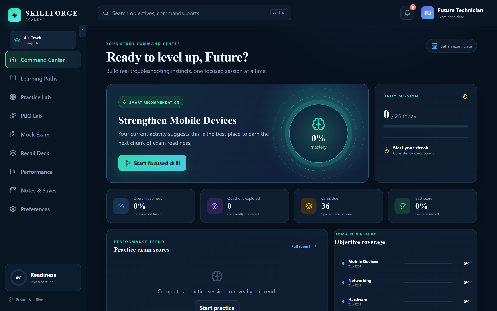
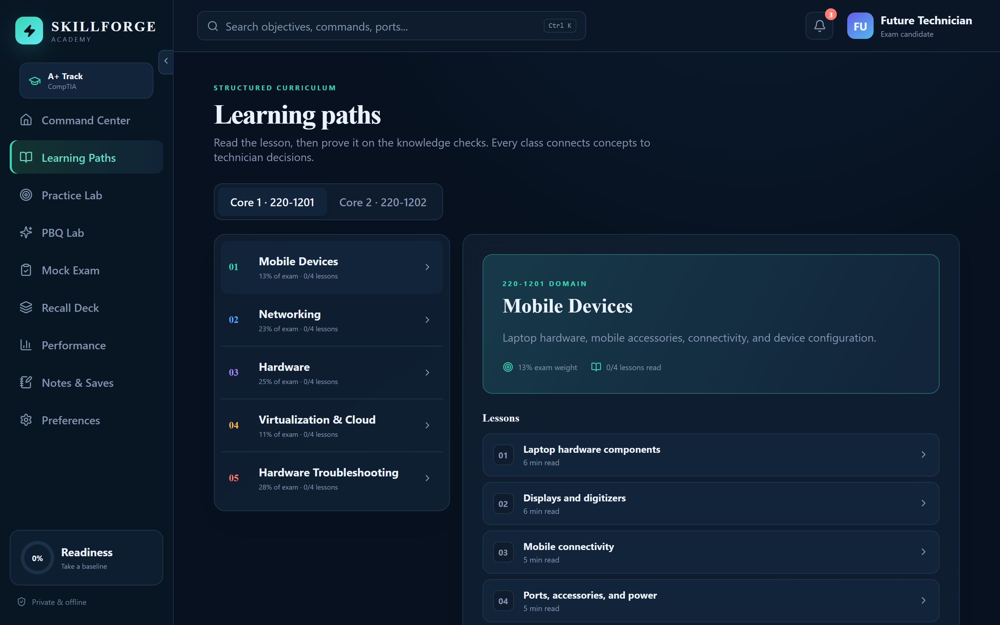
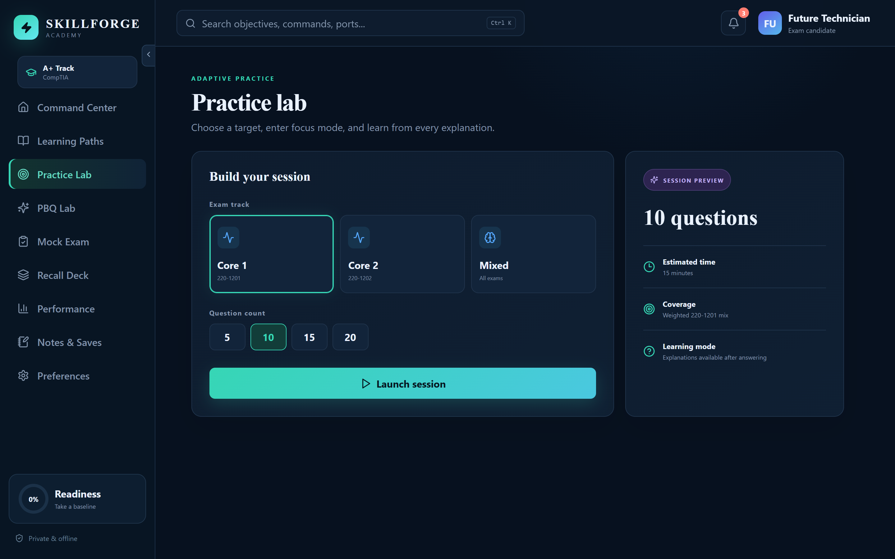
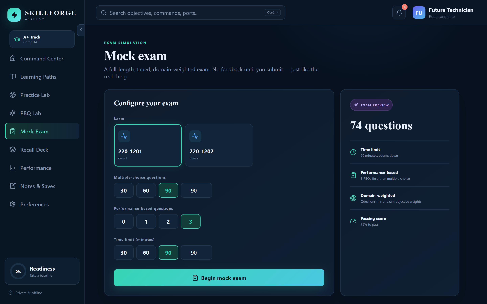
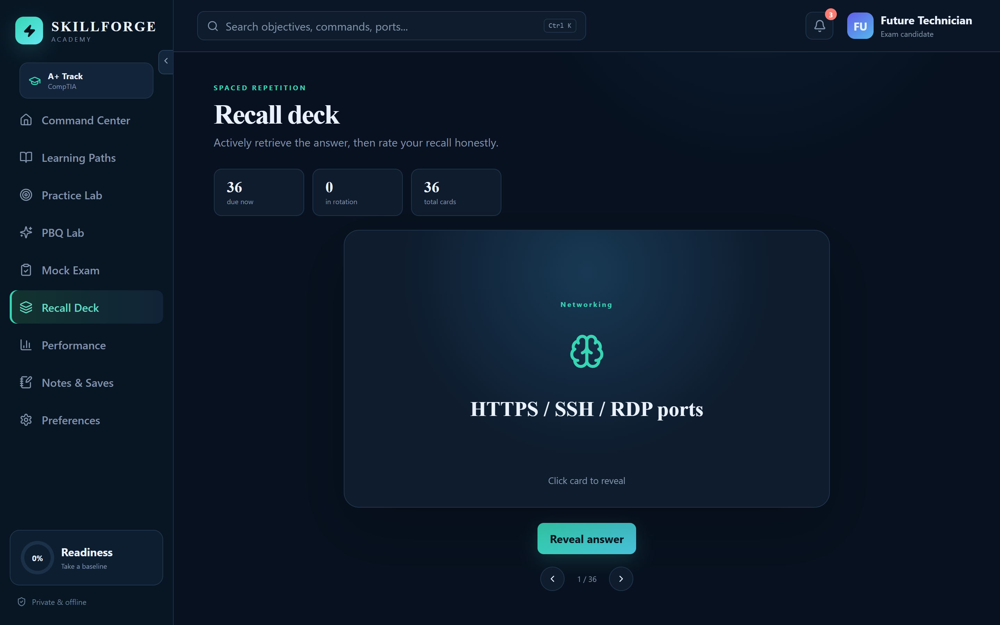

# SkillForge Academy

Offline-first certification learning and exam-preparation software.

Tracks: CompTIA A+ · CompTIA Network+ · CompTIA Security+.

> SkillForge Academy was previously developed under the working name Apex A+ Academy.

[](https://tauri.app/)
[](https://www.rust-lang.org/)
[](https://react.dev/)
[](https://www.typescriptlang.org/)
[](#system-requirements)

---

## Why SkillForge Academy?

CompTIA certification prep often means jumping between notes, flashcard sites, video courses, and generic quiz tools. SkillForge Academy brings those workflows together in a fast desktop application designed around active recall and measurable progress, with separate progress for each certification track you study.

- **Study offline** with local-first learner data and no required account.
- **Switch tracks** between CompTIA A+, Network+, and Security+ — each with its own progress, streaks, and analytics.
- **Practice real decisions** through original troubleshooting and support scenarios.
- **Target weak domains** with objective-level accuracy and readiness analytics.
- **Remember more** using a spaced-repetition recall deck.
- **Stay focused** in a polished environment built specifically for certification preparation.

## Screenshots

**Study Command Center** — your readiness, daily mission, streaks, score trend, and the next best drill at a glance.



**Learning Paths** — structured curriculum by exam domain and objective, with lessons, progress, and knowledge checks.



| Practice Lab | Mock Exam |
|---|---|
|  |  |

**Multi-track switcher** — keep separate progress, streaks, and analytics for CompTIA A+, Network+, and Security+.


**Performance analytics** — multi-track progress and an objective-level coverage heatmap that pinpoints weak spots.


| Recall Deck | Multi-select questions |
|---|---|
|  |  |

> New to the app? See the [getting-started guide](docs/getting-started.md). Screenshots are regenerated from the live app — see [docs/screenshots/README.md](docs/screenshots/README.md).

## Features

### Study Command Center

See exam readiness, daily goals, streaks, score trends, domain mastery, and the next recommended focus area from one dashboard.

### Structured Learning Paths

Explore every Core 1 and Core 2 domain by exam weight, topic group, objective, and knowledge check. The curriculum is organized for focused sessions instead of endless scrolling.

### Practice Lab

Build custom sessions for `220-1201`, `220-1202`, or both cores. Questions come in single-answer and multi-select ("choose TWO/THREE") formats, and each original question includes:

- Difficulty and objective labels
- Immediate answer feedback
- Technician-focused explanations
- Question bookmarking
- Timed session tracking
- Detailed post-session review

### Mock Exams

Sit a full-length, timed, domain-weighted exam for any track's exam. Questions are drawn in proportion to the real objective weights, the timer counts down and auto-submits at zero, and there is no feedback until you finish — then you get a pass/fail result against that track's official pass line (A+ 75%, Network+ 80%, Security+ 83%), a per-domain breakdown, and a full review.

### Performance-Based Questions

Beyond multiple choice, practice interactive **matching** (assign items to categories), **ordering** (sequence steps), and **fill-in / command-entry** questions in a dedicated PBQ Lab or at the start of mock exams. Each simulation is graded with partial credit and includes an explanation.

### Spaced-Repetition Flashcards

Rate each recall as Again, Hard, Good, or Easy. SkillForge automatically schedules the card's next review interval so difficult material returns sooner.

### Performance Analytics

Track score history, domain accuracy, question attempts, session duration, personal bests, and readiness signals over time.

### Notes and Saved Questions

Create a private technical knowledge base for commands, ports, troubleshooting sequences, mnemonics, and concepts that need another pass.

### Global Search and Focused Drills

Press `Ctrl+K` to search domains, objectives, practice explanations, answers, and flashcards. Search results and learning paths can launch drills scoped to a single weak domain.

### Progress Backup

Export learner progress, notes, bookmarks, settings, daily activity, and spaced-repetition scheduling as a passphrase-protected portable backup. AES-256-GCM encryption keeps cross-device transfers private, while legacy plain JSON backups remain importable.

See [Backup, Restore, And Cross-Device Transfer](docs/backup-restore.md) for platform compatibility, restore steps, and recovery guidance.

### Private by Design

Progress is stored locally through the Rust backend. The app does not require a cloud account or send learner activity to an external service.

## Certification Tracks

SkillForge Academy ships three CompTIA tracks. Every published exam objective in each track has a dedicated lesson and a mapped practice set, and each track keeps its own progress, streaks, and analytics. Objective currency is tracked in [docs/objective-drift-watch.md](docs/objective-drift-watch.md).

| Track | Exam(s) | Objective coverage |
| --- | --- | --- |
| **CompTIA A+** | Core 1 `220-1201`, Core 2 `220-1202` (V15) | 63/63 objectives — 392 questions, 68 lessons |
| **CompTIA Network+** | `N10-009` | 25/25 objectives — 179 questions, 41 lessons |
| **CompTIA Security+** | `SY0-701` | 28/28 objectives — 199 questions, 41 lessons |

The A+ track is organized around the current V15 series:

| Exam | Domains covered |
| --- | --- |
| **Core 1: 220-1201** | Mobile Devices, Networking, Hardware, Virtualization and Cloud Computing, Hardware and Network Troubleshooting |
| **Core 2: 220-1202** | Operating Systems, Security, Software Troubleshooting, Operational Procedures |

All practice material across every track is original educational content. It does not contain exam dumps, recalled live exam questions, or proprietary CompTIA assessment content.

## Technology

| Layer | Technology | Purpose |
| --- | --- | --- |
| Desktop/mobile shell | Tauri 2 | Native Windows packaging plus the planned Android mobile target |
| Backend | Rust | Durable local JSON persistence and desktop commands |
| Interface | React 19 + TypeScript | Responsive study, testing, and analytics workflows |
| Build system | Vite 8 | Fast development and optimized production builds |
| Data visualization | Recharts | Readiness trends and domain analytics |
| Icons | Lucide React | Consistent interface iconography |
| Installer | NSIS | Standard x64 Windows setup executable |

## Architecture

```text
SkillForgeAcademy/
|-- src/                       React and TypeScript application
|   |-- App.tsx                Navigation and product workflows
|   |-- data.ts                Original domains, questions, and cards
|   |-- styles.css             Responsive dark and light themes
|   `-- types.ts               Learner and assessment data contracts
|-- src-tauri/                 Native desktop layer
|   |-- src/lib.rs             Rust persistence commands
|   |-- capabilities/          Tauri security permissions
|   `-- tauri.conf.json        Window and NSIS bundle configuration
|-- app-icon.svg               Source application artwork
`-- package.json               Frontend and desktop build commands
```

Learner state is written atomically to the operating system's application-data directory. Browser development mode falls back to `localStorage`, allowing frontend work without launching the desktop shell.

## Install and Run

### System Requirements

- Windows 10 or Windows 11, x64
- Microsoft Edge WebView2 Runtime, included with current Windows releases
- Approximately 100 MB of available disk space

### Installer

**Current release candidate:** SkillForge Academy `1.4.0` (Windows x64 installer), built locally at `src-tauri/target/release/bundle/nsis/SkillForge Academy_1.4.0_x64-setup.exe`.

**Latest published GitHub release:** [SkillForge Academy 1.3.2](https://github.com/ForgeWireLabs/skillforge-academy/releases/tag/v1.3.2). Publishing `1.4.0` to GitHub is pending resolution of an external billing issue.

> `1.3.0` is the first release under the SkillForge Academy name. Earlier installers were published as `Apex A+ Academy_*` (e.g. `Apex A+ Academy_1.2.1_x64-setup.exe`).

Download the `.exe`, run it, and follow the prompts. Because the build is not yet code-signed, Windows SmartScreen may show an unrecognized-publisher warning — choose **More info → Run anyway**. To sign your own builds and remove that warning, see [docs/CODE-SIGNING.md](docs/CODE-SIGNING.md).

A SHA-256 checksum is attached to each release as `SHA256SUMS.txt`. Verify your download in PowerShell:

```powershell
Get-FileHash ".\SkillForge Academy_1.4.0_x64-setup.exe" -Algorithm SHA256
```

## Development

### Prerequisites

- [Node.js LTS](https://nodejs.org/)
- [Rust stable](https://www.rust-lang.org/tools/install)
- [Tauri prerequisites for Windows](https://v2.tauri.app/start/prerequisites/)

### Start the Desktop App

```powershell
git clone https://github.com/ForgeWireLabs/skillforge-academy.git
cd skillforge-academy
npm install
npm run desktop:dev
```

### Frontend-Only Development

```powershell
npm run dev
```

### Production Build

```powershell
npm run desktop:build
```

The optimized executable and NSIS installer are generated under:

```text
src-tauri/target/release/
src-tauri/target/release/bundle/nsis/
```

### Android Mobile Development

Android support follows the Tauri mobile CLI path from the same app codebase.
See [docs/android-mobile.md](docs/android-mobile.md) for prerequisites, the
current local NDK blocker, mobile information architecture, storage stance, and
the Android validation checklist.

```powershell
npm run mobile:android:init
npm run mobile:android:dev
npm run mobile:android:build
```

### Validation

```powershell
npm run validate:content   # schema-checks the question and flashcard banks
npm run validate:a11y      # checks required keyboard/accessibility affordances
npm test                   # unit tests for scoring, streaks, scheduling, mastery
npm run build
cargo fmt --check --manifest-path src-tauri/Cargo.toml
cargo check --manifest-path src-tauri/Cargo.toml
```

### Certification Authoring

New certification tracks are scaffolded and validated through the content factory:

```powershell
npm run scaffold:cert -- --id network-plus --prefix netplus --name "CompTIA Network+" --shortName "Network+" --exam N10-009
npm run validate:content
```

See [docs/certification-authoring.md](docs/certification-authoring.md) for the full manifest, bank, ID, lesson, and quality rules.

## Data and Privacy

- No registration or learner account is required.
- Study history, notes, bookmarks, settings, and flashcard scheduling remain on the local computer.
- Generated learner data and build artifacts are excluded from source control.
- Removing the application does not necessarily remove its app-data directory; delete that directory separately when a complete data reset is required.

### Upgrading from Apex A+ Academy

The rename to SkillForge Academy **does not move or reset existing learner data**. The application identifier (`com.apexlearning.aplusacademy`), the browser `localStorage` key (`apex-state`), and the encrypted backup format/extension (`.apexbackup`) are intentionally unchanged, so the renamed app reads the same local data directory and imports older backups without conversion. The Windows installer includes a pre-install hook that silently removes an existing "Apex A+ Academy" installation before installing SkillForge Academy; the shared app-data location is preserved.

## Project status

SkillForge Academy is an active desktop MVP. Three CompTIA tracks — A+, Network+, and Security+ — are usable today with full objective coverage, while content depth, accessibility testing, installer trust, and additional certification tracks remain ongoing work.

## Roadmap

Shipped:

- Multi-certification platform: a content factory, per-track content directories, and a sidebar track switcher with per-track progress, streaks, and analytics
- Three CompTIA tracks — A+ (V15), Network+ (N10-009), and Security+ (SY0-701) — each objective-complete with a lesson and a mapped practice set for every published exam objective
- Per-track mock-exam pass thresholds derived from each exam's official scaled score
- Objective/command search with a `Ctrl K` command palette
- Encrypted backup restore and cross-device transfer with legacy JSON import support
- Content banks moved to validated JSON loaded by the desktop backend
- Spaced repetition upgraded to an SM-2 scheduler
- Dedicated PBQ simulations with matching, ordering, fill-in / command-entry, scoring, and explanations
- Multi-select ("choose two/three") questions alongside single-answer multiple choice
- Configurable full-length mock exams with custom question, PBQ, and time limits
- Automated tagged Windows release builds and SHA-256 checksum publishing
- Skip navigation, visible keyboard focus, labelled landmarks, escape handling, and automated accessibility checks
- Getting-started and contributor onboarding guides, an in-app first-run walkthrough, and refreshed multi-track screenshots with a repeatable capture process
- Focus-trapped dialogs, keyboard-dismissable menus, and a vendor-agnostic content model ready for additional (non-CompTIA) tracks

Next:

- Add installer code signing when a trusted Windows certificate is available
- Screen-reader (NVDA/VoiceOver) walkthrough of every view and the lesson reader
- Author the next certification tracks on the content factory
- Continue expanding original assessment content and future simulation formats such as hotspots

## Contributing

Issues and focused pull requests are welcome. Useful contributions include original practice scenarios, accessibility improvements, test coverage, documentation, and corrections to technical explanations.

Before contributing assessment content:

1. Write the question and explanation in your own words.
2. Do not submit recalled questions from a live certification exam.
3. Include the relevant exam, domain, objective, answer, and rationale.
4. Verify commands, ports, standards, and platform behavior against authoritative documentation.

## License

Licensed under the [Apache License, Version 2.0](LICENSE).

## Trademark Notice

CompTIA, A+, Network+, Security+, and related marks are trademarks of CompTIA, Inc. SkillForge Academy is an independent educational project and is not affiliated with, sponsored by, or endorsed by CompTIA. Exam objectives and certification requirements may change; always compare your study plan with the official CompTIA materials.

---

<div align="center">
  <strong>Build knowledge. Practice judgment. Walk into the exam prepared.</strong>
</div>
